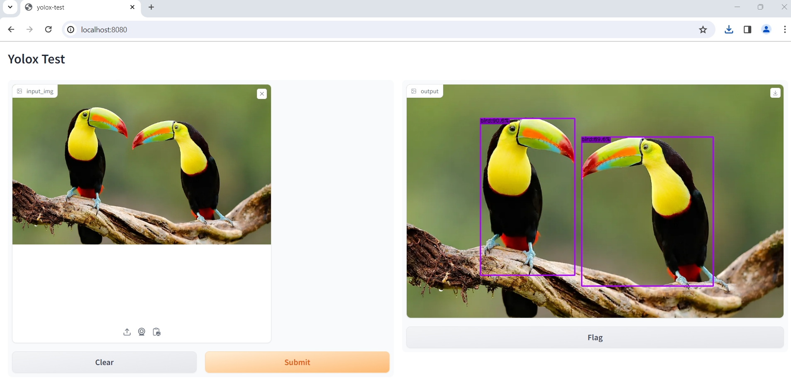

# YOLOX test

### build docker

```
bash build_docker.sh
``` 

### run
```
bash first_run.sh
```

### into shell
```
bash shell.sh
```

test

on terminal
```
bash test.sh YOLOX/assets/dog.jpg
```

on web
```
python ui.py
```

```
http://localhost:8080
```





if Error `ASGI` :

```
ERROR: Exception in ASGI application
```

run

```
pip install httpx==0.25.0
```
